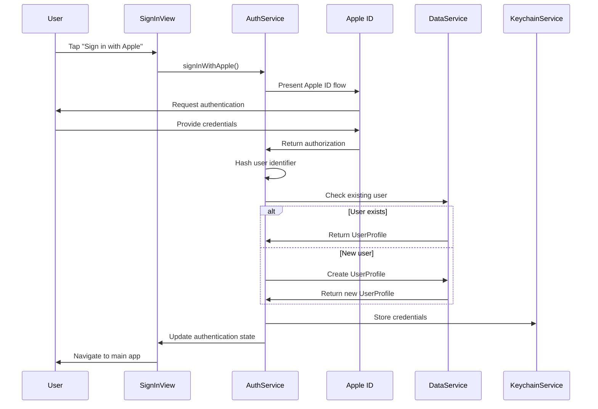

# Design Document

## Overview

The Apple ID sign-in feature leverages Apple's Sign in with Apple service to provide secure, privacy-focused authentication for the TribeBoard app. The design builds upon the existing AuthService architecture and integrates seamlessly with the current SwiftData and CloudKit infrastructure.

The implementation follows Apple's best practices for authentication, including secure credential storage, proper error handling, and privacy protection through user identifier hashing.

## Architecture

### High-Level Architecture

```
┌─────────────────┐    ┌─────────────────┐    ┌─────────────────┐
│   UI Layer      │    │  Service Layer  │    │  Data Layer     │
│                 │    │                 │    │                 │
│ SignInView      │───▶│ AuthService     │───▶│ UserProfile     │
│ AuthStateView   │    │ KeychainService │    │ SwiftData       │
│ ProfileView     │    │ DataService     │    │ CloudKit        │
└─────────────────┘    └─────────────────┘    └─────────────────┘
```

### Authentication Flow



## Components and Interfaces

### 1. AuthService (Existing - Enhanced)

The existing AuthService already provides comprehensive Apple ID authentication functionality:

**Key Methods:**
- `signInWithApple() async throws` - Handles Apple ID authentication flow
- `signOut() async throws` - Clears authentication state and stored credentials
- `checkExistingAuthentication()` - Validates stored credentials on app launch
- `getCurrentUser() -> UserProfile?` - Returns current authenticated user

**Published Properties:**
- `@Published var isAuthenticated: Bool` - Authentication state
- `@Published var currentUser: UserProfile?` - Current user profile
- `@Published var isLoading: Bool` - Loading state for UI feedback

### 2. Sign-In UI Components

**SignInView**
- Primary authentication interface
- "Sign in with Apple" button with proper styling
- Error message display
- Loading state indicators

**AuthenticationStateView**
- Wrapper component that manages authentication flow
- Redirects to SignInView when not authenticated
- Shows main app content when authenticated

### 3. KeychainService (Existing)

Secure storage for authentication credentials:
- Stores hashed Apple user identifiers
- Provides secure credential retrieval
- Handles keychain errors gracefully

### 4. UserProfile Model (Existing)

SwiftData model with CloudKit sync:
- `appleUserIdHash: String` - Secure hash of Apple user identifier
- `displayName: String` - User's display name
- CloudKit synchronization capabilities

## Data Models

### Authentication Data Flow

```
Apple ID Credential
├── user: String (Apple identifier)
├── fullName: PersonNameComponents?
├── email: String?
└── authorizationCode: Data?

↓ Processing

UserProfile (SwiftData)
├── id: UUID
├── displayName: String
├── appleUserIdHash: String (SHA256 hash)
├── avatarUrl: URL?
├── createdAt: Date
└── CloudKit sync properties
```

### Keychain Storage Structure

```
Keychain Items:
├── "apple_user_id_hash" → String (SHA256 hash)
└── Service: "net.dataenvy.TribeBoard.auth"
```

## Error Handling

### AuthError Enumeration

The existing AuthService defines comprehensive error handling:

1. **authorizationFailed** - General authentication failure
2. **userCancelled** - User cancelled the sign-in process
3. **networkUnavailable** - Network connectivity issues
4. **invalidCredentials** - Invalid or malformed credentials
5. **keychainError** - Secure storage failures
6. **dataServiceError** - Database operation failures
7. **unknownError** - Unexpected errors with wrapped details

### Error Recovery Strategies

- **Network Errors**: Display retry options with network status
- **User Cancellation**: Return to sign-in screen without error message
- **Keychain Errors**: Clear stored data and prompt re-authentication
- **Data Errors**: Fallback to local storage with sync retry

## Testing Strategy

### Unit Testing

1. **AuthService Tests**
   - Mock Apple ID authorization responses
   - Test error handling scenarios
   - Verify credential storage and retrieval
   - Test user profile creation and updates

2. **KeychainService Tests**
   - Test secure storage operations
   - Verify data encryption and retrieval
   - Test error scenarios (keychain unavailable, etc.)

3. **UserProfile Tests**
   - Validate model properties and relationships
   - Test CloudKit synchronization
   - Verify data integrity and validation

### Integration Testing

1. **Authentication Flow Tests**
   - End-to-end sign-in process
   - Sign-out and state clearing
   - App launch authentication check
   - Network failure scenarios

2. **UI Integration Tests**
   - Sign-in button interactions
   - Loading state displays
   - Error message presentations
   - Navigation flow validation

### Security Testing

1. **Credential Security**
   - Verify Apple ID hashing implementation
   - Test keychain storage encryption
   - Validate credential clearing on sign-out

2. **Privacy Compliance**
   - Ensure no plain-text Apple IDs are stored
   - Verify minimal data collection
   - Test private email relay handling

## Implementation Considerations

### Privacy and Security

- **User Identifier Hashing**: Apple user identifiers are hashed using SHA256 before storage
- **Keychain Storage**: All authentication data stored in iOS keychain with appropriate access controls
- **Private Email Relay**: Support for Apple's private email relay service
- **Minimal Data Collection**: Only request necessary scopes (name and email)

### Performance Optimization

- **Async/Await**: All authentication operations use modern Swift concurrency
- **Background Authentication Check**: Validate stored credentials on app launch
- **Efficient State Management**: Use @Published properties for reactive UI updates

### CloudKit Integration

- **Automatic Sync**: UserProfile automatically syncs to CloudKit when authenticated
- **Offline Support**: App functions without CloudKit connectivity
- **Conflict Resolution**: CloudKit handles data conflicts automatically

### Accessibility

- **VoiceOver Support**: All authentication UI elements properly labeled
- **Dynamic Type**: Text scales appropriately with user preferences
- **High Contrast**: UI adapts to accessibility display preferences