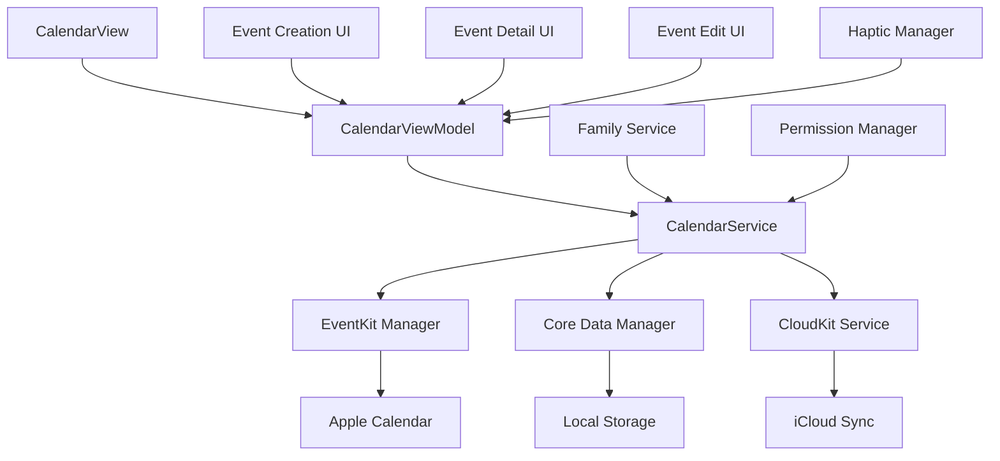

# Design Document

## Overview

The Calendar Enhancement feature transforms the existing TribeBoard calendar from a read-only display into a fully functional scheduling system with Apple Calendar integration. The design focuses on providing seamless event management for both shared family events and personal schedules while maintaining data consistency across devices through EventKit synchronization.

The enhanced calendar will serve as the central hub for family scheduling, supporting create, read, update, and delete operations for events, with intelligent privacy controls and robust offline capabilities. The system will integrate deeply with Apple's EventKit framework to provide native calendar synchronization while maintaining TribeBoard's family-centric approach to event sharing.

## Architecture

### System Components



### Data Flow Architecture

The calendar system follows a layered architecture with clear separation of concerns:

1. **Presentation Layer**: SwiftUI views for calendar display and event management
2. **Business Logic Layer**: ViewModels handling state management and user interactions
3. **Service Layer**: CalendarService coordinating between data sources and business logic
4. **Data Layer**: Core Data for local persistence, EventKit for Apple Calendar sync, CloudKit for family sharing

### Privacy Architecture

Events are categorized into two privacy levels:
- **Family Shared**: Visible to all family members, synchronized across family accounts
- **Personal**: Visible only to the creator, stored locally and in personal Apple Calendar

## Components and Interfaces

### Core Models

#### Enhanced CalendarEvent Model
```swift
@Model
class CalendarEvent {
    var id: UUID
    var title: String
    var startDate: Date
    var endDate: Date
    var isAllDay: Bool
    var location: String?
    var notes: String?
    var privacyLevel: PrivacyLevel
    var createdBy: UUID
    var familyId: UUID?
    var eventKitIdentifier: String?
    var lastModified: Date
    var isDeleted: Bool
    
    enum PrivacyLevel: String, CaseIterable {
        case familyShared = "family_shared"
        case personal = "personal"
    }
}
```

#### EventKit Integration Model
```swift
struct EventKitEvent {
    let identifier: String
    let title: String
    let startDate: Date
    let endDate: Date
    let location: String?
    let notes: String?
    let calendar: EKCalendar
}
```

### Service Interfaces

#### CalendarService Protocol
```swift
protocol CalendarServiceProtocol {
    func createEvent(_ event: CalendarEvent) async throws -> CalendarEvent
    func updateEvent(_ event: CalendarEvent) async throws -> CalendarEvent
    func deleteEvent(_ event: CalendarEvent) async throws
    func fetchEvents(for dateRange: DateInterval) async throws -> [CalendarEvent]
    func fetchFamilyEvents(for familyId: UUID, dateRange: DateInterval) async throws -> [CalendarEvent]
    func fetchPersonalEvents(for userId: UUID, dateRange: DateInterval) async throws -> [CalendarEvent]
    func syncWithAppleCalendar() async throws
    func enableAppleCalendarSync() async throws
    func disableAppleCalendarSync() async throws
}
```

#### EventKit Manager Protocol
```swift
protocol EventKitManagerProtocol {
    func requestAccess() async throws -> Bool
    func createTribeBoardCalendar() async throws -> EKCalendar
    func syncEventToAppleCalendar(_ event: CalendarEvent) async throws -> String
    func updateEventInAppleCalendar(_ event: CalendarEvent) async throws
    func deleteEventFromAppleCalendar(_ eventIdentifier: String) async throws
    func fetchEventsFromAppleCalendar(for dateRange: DateInterval) async throws -> [EventKitEvent]
}
```

### UI Components

#### CalendarView Enhancement
- Monthly/weekly/daily view modes
- Event creation through date selection
- Event filtering (All/Family/Personal)
- Apple Calendar sync toggle
- Accessibility support with VoiceOver

#### Event Management Views
- **EventCreationView**: Form for creating new events with privacy selection
- **EventDetailView**: Enhanced with edit/delete capabilities
- **EventEditView**: Full editing interface with validation
- **EventListView**: Filtered list view for different event types

#### Sync Management UI
- **SyncSettingsView**: Apple Calendar integration controls
- **SyncStatusView**: Real-time sync status and error handling
- **ConflictResolutionView**: UI for handling sync conflicts

## Data Models

### Core Data Schema

#### CalendarEvent Entity
```swift
@objc(CalendarEvent)
public class CalendarEvent: NSManagedObject {
    @NSManaged public var id: UUID
    @NSManaged public var title: String
    @NSManaged public var startDate: Date
    @NSManaged public var endDate: Date
    @NSManaged public var isAllDay: Bool
    @NSManaged public var location: String?
    @NSManaged public var notes: String?
    @NSManaged public var privacyLevel: String
    @NSManaged public var createdBy: UUID
    @NSManaged public var familyId: UUID?
    @NSManaged public var eventKitIdentifier: String?
    @NSManaged public var lastModified: Date
    @NSManaged public var isDeleted: Bool
    @NSManaged public var needsSync: Bool
}
```

#### SyncConfiguration Entity
```swift
@objc(SyncConfiguration)
public class SyncConfiguration: NSManagedObject {
    @NSManaged public var userId: UUID
    @NSManaged public var isAppleCalendarSyncEnabled: Bool
    @NSManaged public var tribeBoardCalendarIdentifier: String?
    @NSManaged public var lastSyncDate: Date?
    @NSManaged public var syncConflictResolution: String
}
```

### CloudKit Schema

#### CKRecord Types
- **CalendarEvent**: For family shared events
- **EventPermission**: For managing family calendar permissions
- **SyncMetadata**: For tracking sync state across devices

### EventKit Integration Schema

#### Calendar Creation
- Create dedicated "TribeBoard" calendar in user's Apple Calendar
- Separate calendars for "TribeBoard Family" and "TribeBoard Personal"
- Maintain calendar references for sync operations

## Error Handling

### Error Categories

#### Sync Errors
```swift
enum CalendarSyncError: LocalizedError {
    case eventKitAccessDenied
    case calendarCreationFailed
    case syncConflictDetected(CalendarEvent, CalendarEvent)
    case networkUnavailable
    case appleCalendarNotFound
    
    var errorDescription: String? {
        switch self {
        case .eventKitAccessDenied:
            return "Calendar access is required to sync with Apple Calendar"
        case .calendarCreationFailed:
            return "Failed to create TribeBoard calendar"
        case .syncConflictDetected:
            return "Event was modified in multiple places"
        case .networkUnavailable:
            return "Network connection required for sync"
        case .appleCalendarNotFound:
            return "TribeBoard calendar not found in Apple Calendar"
        }
    }
}
```

#### Validation Errors
```swift
enum EventValidationError: LocalizedError {
    case titleRequired
    case invalidDateRange
    case endDateBeforeStartDate
    case eventTooLong
    case permissionDenied
    
    var errorDescription: String? {
        switch self {
        case .titleRequired:
            return "Event title is required"
        case .invalidDateRange:
            return "Invalid date range selected"
        case .endDateBeforeStartDate:
            return "End date cannot be before start date"
        case .eventTooLong:
            return "Event duration cannot exceed 24 hours"
        case .permissionDenied:
            return "You don't have permission to modify this event"
        }
    }
}
```

### Error Recovery Strategies

#### Sync Conflict Resolution
1. **Last Modified Wins**: Default strategy using timestamp comparison
2. **User Choice**: Present conflict resolution UI for manual selection
3. **Merge Strategy**: Combine non-conflicting changes where possible

#### Offline Handling
1. Queue operations for later sync when offline
2. Store pending changes in local database
3. Retry failed operations with exponential backoff
4. Provide clear offline status indicators

## Testing Strategy

### Unit Testing

#### CalendarService Tests
- Event CRUD operations
- Privacy level enforcement
- Sync state management
- Error handling scenarios

#### EventKit Manager Tests
- Apple Calendar integration
- Permission handling
- Sync operation validation
- Calendar creation and management

#### ViewModel Tests
- State management
- User interaction handling
- Error propagation
- Accessibility compliance

### Integration Testing

#### End-to-End Sync Testing
- Create event in TribeBoard → Verify in Apple Calendar
- Modify event in Apple Calendar → Verify in TribeBoard
- Delete event scenarios
- Conflict resolution workflows

#### Family Sharing Tests
- Family event visibility across members
- Permission enforcement
- Privacy level compliance
- Multi-device synchronization

#### Offline/Online Transition Tests
- Offline event creation and editing
- Sync queue processing on reconnection
- Conflict detection and resolution
- Data consistency validation

### UI Testing

#### Accessibility Testing
- VoiceOver navigation
- Dynamic Type support
- High Contrast mode compatibility
- Keyboard navigation

#### User Journey Testing
- Complete event creation workflow
- Event editing and deletion
- Apple Calendar sync setup
- Error state handling

### Performance Testing

#### Sync Performance
- Large event dataset synchronization
- Concurrent sync operations
- Memory usage during sync
- Battery impact assessment

#### UI Responsiveness
- Calendar view rendering with many events
- Smooth scrolling and navigation
- Event creation form performance
- Search and filtering speed

### Security Testing

#### Privacy Validation
- Personal event isolation
- Family event access control
- EventKit permission handling
- Data encryption verification

#### Sync Security
- CloudKit authentication
- EventKit access token management
- Secure data transmission
- Local data protection

## Implementation Phases

### Phase 1: Core Event Management
- Enhanced CalendarEvent model with Core Data
- Basic CRUD operations for events
- Privacy level implementation
- Event validation and error handling

### Phase 2: Apple Calendar Integration
- EventKit framework integration
- TribeBoard calendar creation
- Basic sync functionality
- Permission management

### Phase 3: Advanced Sync Features
- Bidirectional synchronization
- Conflict detection and resolution
- Offline queue management
- Sync status monitoring

### Phase 4: UI Enhancement
- Enhanced calendar views
- Event creation and editing forms
- Sync settings interface
- Accessibility improvements

### Phase 5: Family Features
- Family event sharing
- Permission management
- Multi-device synchronization
- Admin controls

### Phase 6: Polish and Optimization
- Performance optimization
- Advanced error handling
- Haptic feedback integration
- Comprehensive testing