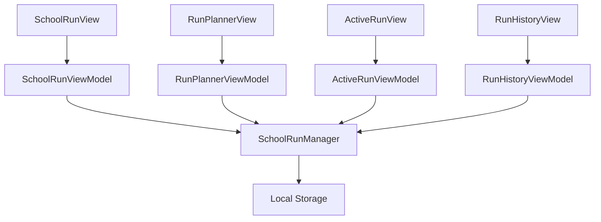
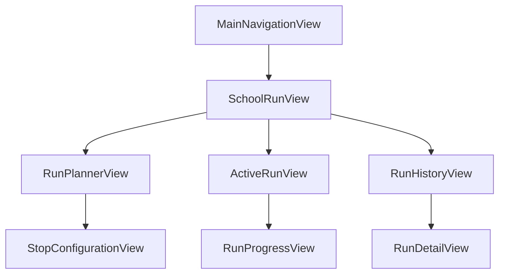

# Design Document

## Overview

The School Run module is a comprehensive feature addition to TribeBoard that enables parents to schedule, manage, and execute school transportation runs. The module integrates seamlessly with the existing 5-tab navigation structure, maintaining consistency with current design patterns, state management approaches, and styling conventions. All functionality operates locally in memory, providing a complete user experience without external dependencies.

## Architecture

### High-Level Architecture

The School Run module follows TribeBoard's established MVVM architecture pattern:

```
Views (SwiftUI) ↔ ViewModels (ObservableObject) ↔ Models (Data Structures) ↔ Manager (Data Persistence)
```

### Integration Points

1. **Navigation Integration**: Extends existing `NavigationTab` enum with `.schoolRun` case
2. **State Management**: Leverages `AppState` for global navigation coordination
3. **Design System**: Uses existing `DesignSystem`, `BrandStyle`, and `BrandColors`
4. **Accessibility**: Implements `EnhancedAccessibility` patterns
5. **Animation**: Utilizes `AnimationUtilities` for consistent micro-interactions

### Data Flow



## Components and Interfaces

### Core Data Models

#### SchoolRun
```swift
struct SchoolRun: Identifiable, Codable {
    let id: UUID
    var title: String
    var date: Date
    var route: [RunStop]
    var status: RunStatus
    var createdAt: Date
    var estimatedDuration: TimeInterval
    
    // Computed properties for UI display
    var formattedDate: String
    var participatingChildren: [String]
    var isToday: Bool
}
```

#### RunStop
```swift
struct RunStop: Identifiable, Codable {
    let id: UUID
    var name: String
    var time: Date
    var note: String
    var type: StopType
    var isCompleted: Bool
    
    enum StopType: String, CaseIterable {
        case pickup, dropoff
        
        var icon: String
        var displayName: String
    }
}
```

#### RunStatus
```swift
enum RunStatus: String, CaseIterable {
    case scheduled, inProgress, completed, cancelled
    
    var displayText: String
    var color: Color
    var icon: String
}
```

### View Models

#### SchoolRunViewModel
```swift
@MainActor
class SchoolRunViewModel: ObservableObject {
    @Published var runs: [SchoolRun] = []
    @Published var isLoading: Bool = false
    @Published var errorMessage: String?
    
    private let manager: SchoolRunManager
    
    // Computed properties
    var todaysRuns: [SchoolRun]
    var upcomingRuns: [SchoolRun]
    var completedRuns: [SchoolRun]
    
    // Methods
    func loadRuns()
    func deleteRun(_ run: SchoolRun)
    func startRun(_ run: SchoolRun)
}
```

#### RunPlannerViewModel
```swift
@MainActor
class RunPlannerViewModel: ObservableObject {
    @Published var title: String = ""
    @Published var selectedDate: Date = Date()
    @Published var stops: [RunStop] = []
    @Published var isValid: Bool = false
    
    func addStop()
    func removeStop(at index: Int)
    func saveRun() -> SchoolRun?
    func validateForm()
}
```

#### ActiveRunViewModel
```swift
@MainActor
class ActiveRunViewModel: ObservableObject {
    @Published var currentRun: SchoolRun?
    @Published var currentStopIndex: Int = 0
    @Published var isRunning: Bool = false
    
    var currentStop: RunStop?
    var nextStop: RunStop?
    var progress: Double
    
    func nextStop()
    func endRun()
    func pauseRun()
}
```

### Views Architecture

#### Main Views
1. **SchoolRunView**: Main dashboard showing runs list and quick actions
2. **RunPlannerView**: Form-based interface for creating new runs
3. **ActiveRunView**: Live run execution with map placeholder and controls
4. **RunHistoryView**: Historical runs with filtering and details

#### Component Views
1. **RunCard**: Reusable card component for displaying run information
2. **StopRow**: Individual stop display component
3. **MapPlaceholderView**: Static map visualization using existing patterns
4. **RunStatusBadge**: Status indicator component
5. **QuickActionButtons**: Action buttons with haptic feedback

### Manager Layer

#### SchoolRunManager
```swift
class SchoolRunManager: ObservableObject {
    @Published var runs: [SchoolRun] = []
    @Published var activeRun: SchoolRun?
    
    private let storage: UserDefaults
    
    // CRUD Operations
    func createRun(_ run: SchoolRun)
    func updateRun(_ run: SchoolRun)
    func deleteRun(id: UUID)
    func getRun(id: UUID) -> SchoolRun?
    
    // Run Execution
    func startRun(id: UUID)
    func pauseRun(id: UUID)
    func completeRun(id: UUID)
    func cancelRun(id: UUID)
    
    // Data Persistence
    func saveToStorage()
    func loadFromStorage()
}
```

## Data Models

### Storage Strategy

**Local Storage**: Uses `UserDefaults` for data persistence, following existing TribeBoard patterns:

```swift
private let runsKey = "school_runs_data"
private let activeRunKey = "active_school_run"
```

**Data Structure**:
```json
{
  "runs": [
    {
      "id": "uuid",
      "title": "Morning School Run",
      "date": "2025-01-15T08:00:00Z",
      "status": "scheduled",
      "route": [
        {
          "id": "uuid",
          "name": "Home",
          "time": "2025-01-15T08:00:00Z",
          "type": "pickup",
          "note": "Pick up Emma"
        }
      ]
    }
  ]
}
```

### Mock Data Generation

Following existing `MockDataGenerator` patterns:

```swift
extension MockDataGenerator {
    static func mockSchoolRuns() -> [SchoolRun] {
        // Generate sample runs for demonstration
    }
    
    static func mockRunStops() -> [RunStop] {
        // Generate sample stops
    }
}
```

## Error Handling

### Error Types

```swift
enum SchoolRunError: LocalizedError {
    case invalidRunData
    case runNotFound
    case runAlreadyActive
    case storageError
    
    var errorDescription: String? {
        switch self {
        case .invalidRunData: return "Invalid run information provided"
        case .runNotFound: return "School run not found"
        case .runAlreadyActive: return "Another run is already in progress"
        case .storageError: return "Failed to save run data"
        }
    }
}
```

### Error Handling Strategy

1. **View Level**: Display inline error messages using existing `InlineErrorView`
2. **ViewModel Level**: Publish error states via `@Published var errorMessage: String?`
3. **Manager Level**: Throw specific errors for proper handling upstream
4. **Toast Notifications**: Use existing `ToastManager` for non-critical errors

## Testing Strategy

### Unit Testing

Following existing test structure in `TribeBoardTests/Unit/`:

```
TribeBoardTests/Unit/SchoolRun/
├── Models/
│   ├── SchoolRunTests.swift
│   ├── RunStopTests.swift
│   └── RunStatusTests.swift
├── ViewModels/
│   ├── SchoolRunViewModelTests.swift
│   ├── RunPlannerViewModelTests.swift
│   └── ActiveRunViewModelTests.swift
├── Managers/
│   └── SchoolRunManagerTests.swift
└── Utilities/
    └── SchoolRunMockDataTests.swift
```

### Integration Testing

Following existing integration test patterns:

```
TribeBoardTests/Integration/
└── SchoolRunIntegrationTests.swift
```

### UI Testing

Following existing UI test structure:

```
TribeBoardUITests/SchoolRun/
├── SchoolRunNavigationTests.swift
├── RunPlannerUITests.swift
├── ActiveRunUITests.swift
└── SchoolRunAccessibilityTests.swift
```

### Test Coverage Goals

- **Models**: 100% coverage for data validation and computed properties
- **ViewModels**: 90% coverage for business logic and state management
- **Manager**: 95% coverage for CRUD operations and data persistence
- **Views**: 80% coverage for user interactions and accessibility

### Mock Data Strategy

Extend existing mock data patterns:

```swift
extension MockDataGenerator {
    static func mockSchoolRunScenarios() -> [SchoolRun] {
        return [
            // Today's runs
            mockTodaysRuns(),
            // Upcoming runs
            mockUpcomingRuns(),
            // Completed runs
            mockCompletedRuns(),
            // Edge cases
            mockEdgeCaseRuns()
        ].flatMap { $0 }
    }
}
```

## Navigation Integration

### Tab Bar Integration

Extend existing `NavigationTab` enum:

```swift
enum NavigationTab: String, CaseIterable, Identifiable {
    case dashboard = "dashboard"
    case calendar = "calendar"
    case schoolRun = "schoolRun"  // New case
    case homeLife = "homeLife"
    case tasks = "tasks"
    
    var displayName: String {
        case .schoolRun: return "Run"
    }
    
    var icon: String {
        case .schoolRun: return "car"
    }
    
    var activeIcon: String {
        case .schoolRun: return "car.fill"
    }
}
```

### Navigation Flow



### Deep Linking Support

Extend existing navigation path handling:

```swift
extension AppState {
    func navigateToSchoolRun(runId: UUID? = nil) {
        selectedNavigationTab = .schoolRun
        if let runId = runId {
            navigationPath.append(SchoolRunDestination.runDetail(runId))
        }
    }
}
```

## Accessibility Implementation

### Accessibility Features

1. **VoiceOver Support**: All components include proper accessibility labels and hints
2. **Dynamic Type**: Text scales appropriately with user preferences
3. **High Contrast**: Colors adapt to increased contrast settings
4. **Reduced Motion**: Animations respect user motion preferences
5. **Keyboard Navigation**: Full keyboard support for all interactions

### Implementation Pattern

Following existing accessibility patterns:

```swift
struct RunCard: View {
    var body: some View {
        VStack {
            // Content
        }
        .accessibilityElement(children: .combine)
        .accessibilityLabel("School run: \(run.title)")
        .accessibilityHint("Tap to view run details")
        .accessibilityValue(run.status.displayText)
        .accessibilityAddTraits(.isButton)
    }
}
```

## Performance Considerations

### Memory Management

1. **Lazy Loading**: Load run details only when needed
2. **Image Optimization**: Use SF Symbols for icons, static images for map placeholders
3. **Data Pagination**: Limit displayed runs to recent items with "Load More" functionality
4. **State Cleanup**: Properly dispose of timers and observers

### Storage Optimization

1. **Data Compression**: Use efficient JSON encoding for storage
2. **Cleanup Strategy**: Remove old completed runs after 30 days
3. **Batch Operations**: Group multiple updates into single storage operations

### UI Performance

1. **List Optimization**: Use `LazyVStack` for large run lists
2. **Animation Efficiency**: Use `withAnimation` judiciously
3. **State Updates**: Minimize unnecessary view updates through proper `@Published` usage

## Security Considerations

### Data Privacy

1. **Local Storage Only**: No data transmitted to external servers
2. **Sandboxed Storage**: Data stored within app's sandbox
3. **No Location Tracking**: Use mock location data only
4. **Family Data Isolation**: Runs associated with current family context only

### Input Validation

1. **Form Validation**: Validate all user inputs before saving
2. **Date Validation**: Ensure dates are reasonable and in future
3. **String Sanitization**: Clean user-provided text inputs
4. **Data Integrity**: Validate data structure on load

## Styling and Design System Integration

### Color Scheme

Uses existing TribeBoard color system:

```swift
extension Color {
    static let schoolRunPrimary = Color.brandPrimary
    static let schoolRunSecondary = Color.brandSecondary
    static let schoolRunAccent = Color.accentColor
}
```

### Typography

Follows existing typography scale:

```swift
extension Font {
    static let schoolRunTitle = DesignSystem.Typography.titleLarge
    static let schoolRunBody = DesignSystem.Typography.bodyMedium
    static let schoolRunCaption = DesignSystem.Typography.captionRegular
}
```

### Spacing and Layout

Uses existing spacing system:

```swift
extension DesignSystem.Spacing {
    // Existing spacing values used throughout
    static let cardPadding = DesignSystem.Spacing.lg
    static let itemSpacing = DesignSystem.Spacing.md
    static let compactSpacing = DesignSystem.Spacing.sm
}
```

### Component Styling

Maintains consistency with existing components:

```swift
struct RunCard: View {
    var body: some View {
        VStack {
            // Content
        }
        .cardPadding()
        .background(
            RoundedRectangle(cornerRadius: BrandStyle.cornerRadius)
                .fill(Color(.systemBackground))
                .mediumShadow()
        )
    }
}
```

This design ensures the School Run module integrates seamlessly with TribeBoard's existing architecture while providing a comprehensive and user-friendly experience for managing school transportation runs.