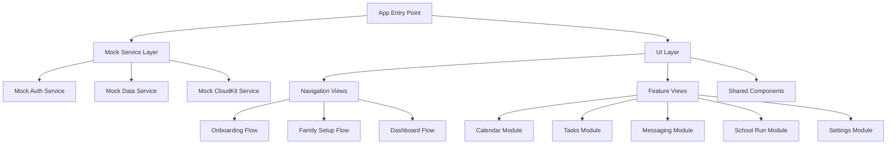

# Design Document

## Overview

The UI/UX prototype branch will create a complete, navigable version of the TribeBoard app that focuses purely on user interface and user experience without any backend dependencies. This prototype will serve as a demo-ready showcase of the app's design, navigation flows, and visual consistency using mock data and service stubs.

The prototype will maintain the existing SwiftUI architecture and design patterns while replacing all service dependencies with mock implementations. This approach ensures the prototype can be easily converted back to a fully functional app by swapping mock services with real implementations.

## Architecture

### High-Level Architecture



### Service Layer Design

The prototype will use a mock service architecture that mirrors the real service interfaces but returns predefined mock data:

- **MockAuthService**: Simulates authentication flows with instant success responses
- **MockDataService**: Provides predefined family, user, and membership data
- **MockCloudKitService**: Simulates CloudKit operations without actual network calls
- **MockSyncManager**: Provides sync status updates using timers and mock states

### Navigation Architecture

The prototype will maintain the existing `AppState` and navigation flow system but with mock data sources:

1. **AppFlow Enum**: Unchanged - represents the main navigation states
2. **AppState**: Modified to use mock services and predefined user journeys
3. **NavigationStack**: Unchanged - maintains the same navigation patterns

## Components and Interfaces

### Mock Service Interfaces

#### MockAuthService
```swift
class MockAuthService: ObservableObject {
    @Published var isAuthenticated: Bool = false
    @Published var currentUser: UserProfile?
    
    func signInWithApple() async -> Result<UserProfile, AuthError>
    func signInWithGoogle() async -> Result<UserProfile, AuthError>
    func signOut() async throws
    func checkAuthenticationStatus() -> Bool
}
```

#### MockDataService
```swift
class MockDataService: ObservableObject {
    private let mockFamilies: [Family]
    private let mockUsers: [UserProfile]
    private let mockMemberships: [Membership]
    
    func createFamily(_ family: Family) async -> Result<Family, DataError>
    func joinFamily(code: String) async -> Result<Family, DataError>
    func fetchUserFamilies(_ userId: UUID) async -> [Family]
    func fetchFamilyMembers(_ familyId: UUID) async -> [Membership]
}
```

#### MockCloudKitService
```swift
class MockCloudKitService: ObservableObject {
    @Published var syncStatus: SyncStatus = .idle
    
    func performInitialSetup() async throws
    func syncFamily(_ family: Family) async -> Result<Void, CloudKitError>
    func generateQRCode(for family: Family) -> String
}
```

### UI Component Architecture

#### Shared Components
All existing shared components will be maintained with enhanced mock data support:

- **LoadingStateView**: Enhanced with realistic loading durations
- **ErrorStateView**: Displays mock error scenarios
- **ToastNotification**: Shows mock success/failure messages
- **FormValidationView**: Provides instant validation feedback
- **SyncStatusView**: Displays mock sync states with animations

#### Navigation Components
- **MainNavigationView**: Modified to use mock services
- **AppLaunchView**: Simplified initialization without real service setup
- **SplashScreenView**: Enhanced with branded animations

### Module-Specific Components

#### Calendar Module Components
```swift
struct MockCalendarView: View {
    let mockEvents: [CalendarEvent]
    let mockBirthdays: [Birthday]
    let mockSchoolRuns: [SchoolRun]
}

struct CalendarEventCard: View
struct BirthdayCard: View
struct SchoolRunCard: View
```

#### Tasks Module Components
```swift
struct MockTasksView: View {
    let mockTasks: [FamilyTask]
    let mockChores: [Chore]
}

struct TaskCard: View
struct ChoreAssignmentView: View
struct TaskStatusIndicator: View
```

#### Messaging Module Components
```swift
struct MockMessagingView: View {
    let mockMessages: [FamilyMessage]
    let mockPosts: [NoticeboardPost]
}

struct MessageBubble: View
struct NoticeboardCard: View
struct MessageComposer: View
```

#### School Run Module Components
```swift
struct MockSchoolRunView: View {
    let mockRoutes: [SchoolRoute]
    let mockPickups: [PickupSchedule]
}

struct RouteMapView: View
struct PickupCard: View
struct NavigationMockup: View
```

## Data Models

### Mock Data Structures

#### Extended Mock Data Generator
```swift
struct MockDataGenerator {
    // Existing family/user data
    static func mockFamilyWithMembers() -> (family: Family, users: [UserProfile], memberships: [Membership])
    
    // New module-specific data
    static func mockCalendarEvents() -> [CalendarEvent]
    static func mockFamilyTasks() -> [FamilyTask]
    static func mockFamilyMessages() -> [FamilyMessage]
    static func mockSchoolRuns() -> [SchoolRun]
    static func mockSettings() -> FamilySettings
}
```

#### New Data Models for Modules
```swift
struct CalendarEvent {
    let id: UUID
    let title: String
    let date: Date
    let type: EventType
    let participants: [UUID]
}

struct FamilyTask {
    let id: UUID
    let title: String
    let assignedTo: UUID
    let dueDate: Date
    let status: TaskStatus
    let points: Int
}

struct FamilyMessage {
    let id: UUID
    let content: String
    let sender: UUID
    let timestamp: Date
    let type: MessageType
}

struct SchoolRun {
    let id: UUID
    let route: String
    let pickupTime: Date
    let dropoffTime: Date
    let driver: UUID
    let passengers: [UUID]
}
```

### Mock Data Scenarios

The prototype will include multiple predefined scenarios:

1. **New User Journey**: Empty state → Onboarding → Family creation
2. **Existing User Journey**: Authentication → Family dashboard
3. **Family Admin Journey**: Full access to all features and settings
4. **Child User Journey**: Limited access appropriate for kids
5. **Visitor Journey**: Temporary access with restrictions

## Error Handling

### Mock Error Scenarios

The prototype will simulate realistic error scenarios:

#### Authentication Errors
- Network timeout simulation
- Invalid credentials
- Account not found
- Service unavailable

#### Family Management Errors
- Duplicate family code
- Invalid family name
- Family not found
- Permission denied

#### Validation Errors
- Form field validation
- Code format validation
- Name length validation
- Role assignment conflicts

### Error Display Strategy

```swift
enum MockErrorType {
    case network
    case validation
    case permission
    case notFound
    
    var displayMessage: String
    var recoveryAction: String?
}
```

## Testing Strategy

### Mock Data Testing

#### Comprehensive Mock Scenarios
1. **Empty States**: New users, no families, no data
2. **Populated States**: Active families with multiple members
3. **Edge Cases**: Single-member families, inactive memberships
4. **Error States**: Network failures, validation errors

#### User Journey Testing
1. **Complete Onboarding Flow**: Start to finish without interruption
2. **Family Creation Flow**: Name input → Code generation → Role selection
3. **Family Joining Flow**: Code entry → Validation → Role assignment
4. **Module Navigation**: Access all features from dashboard

### UI/UX Testing Scenarios

#### Visual Consistency Testing
- Brand colors and gradients across all screens
- Typography consistency
- Icon and image alignment
- Animation smoothness

#### Interaction Testing
- Button press feedback
- Form validation states
- Loading state transitions
- Error message display

#### Accessibility Testing
- VoiceOver navigation
- Dynamic type support
- Color contrast compliance
- Touch target sizes

### Performance Testing

#### Mock Performance Scenarios
- Instant responses for optimal experience
- Simulated loading delays for realism
- Smooth animations and transitions
- Memory usage optimization

## Implementation Phases

### Phase 1: Core Infrastructure
1. Create mock service implementations
2. Modify AppState for mock data
3. Update MainNavigationView for mock services
4. Implement enhanced MockDataGenerator

### Phase 2: Core Flows
1. Enhanced onboarding with mock authentication
2. Family setup flows with mock QR generation
3. Role selection with mock validation
4. Basic dashboard with mock family data

### Phase 3: Feature Modules
1. Calendar module with mock events
2. Tasks module with mock chores
3. Messaging module with mock conversations
4. Settings module with mock preferences

### Phase 4: Advanced Features
1. School Run module with mock navigation
2. Enhanced error handling scenarios
3. Advanced animations and transitions
4. Accessibility improvements

### Phase 5: Polish and Demo Preparation
1. Production-quality visual polish
2. Comprehensive mock data scenarios
3. Demo-specific user journeys
4. Performance optimization

## Design Decisions and Rationales

### Mock Service Architecture
**Decision**: Create mock services that implement the same interfaces as real services
**Rationale**: Allows easy swapping between mock and real implementations without changing UI code

### Data Persistence Strategy
**Decision**: Use in-memory storage for mock data with predefined scenarios
**Rationale**: Eliminates database dependencies while maintaining realistic user experiences

### Navigation Approach
**Decision**: Maintain existing navigation architecture with mock data sources
**Rationale**: Preserves the intended user flow design while enabling backend-free operation

### Animation Strategy
**Decision**: Enhanced animations and transitions for demo appeal
**Rationale**: Creates a polished, production-ready feel that showcases the app's potential

### Error Handling Approach
**Decision**: Comprehensive mock error scenarios with realistic recovery flows
**Rationale**: Demonstrates complete user experience including edge cases and error states

### Accessibility Strategy
**Decision**: Full accessibility compliance in the prototype
**Rationale**: Ensures the design is inclusive and meets production standards from the start